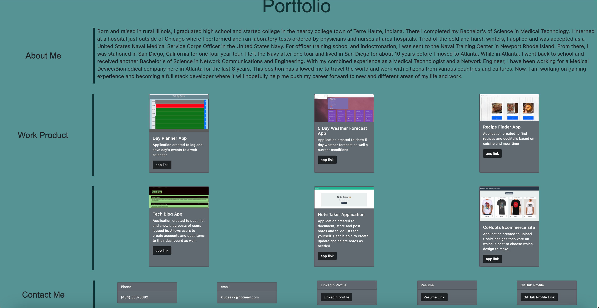

# Updated Portfolio with REACT
    
## Table of Contents
* [Description](#description) 
* [Installation](#installation)
* [Usage](#usage)
* [Credits](#credits)
* [License](#license)
* [Badge](#badge)
* [Questions](#questions)
    
## Description
* Portfolio page created with REACT JS
    
## Installation
* No installation necessary. Compatible web browser is only needed.
    
## Usage
* no instructions necessary.  Compatible web browser is only needed.

    
## Credits
* N/A
    
## License
* Licensed by mit
    
## Badge
* 
    
## Questions
* For any questions, concerns, or additional help, please contact klucas72@hotmail.com.
